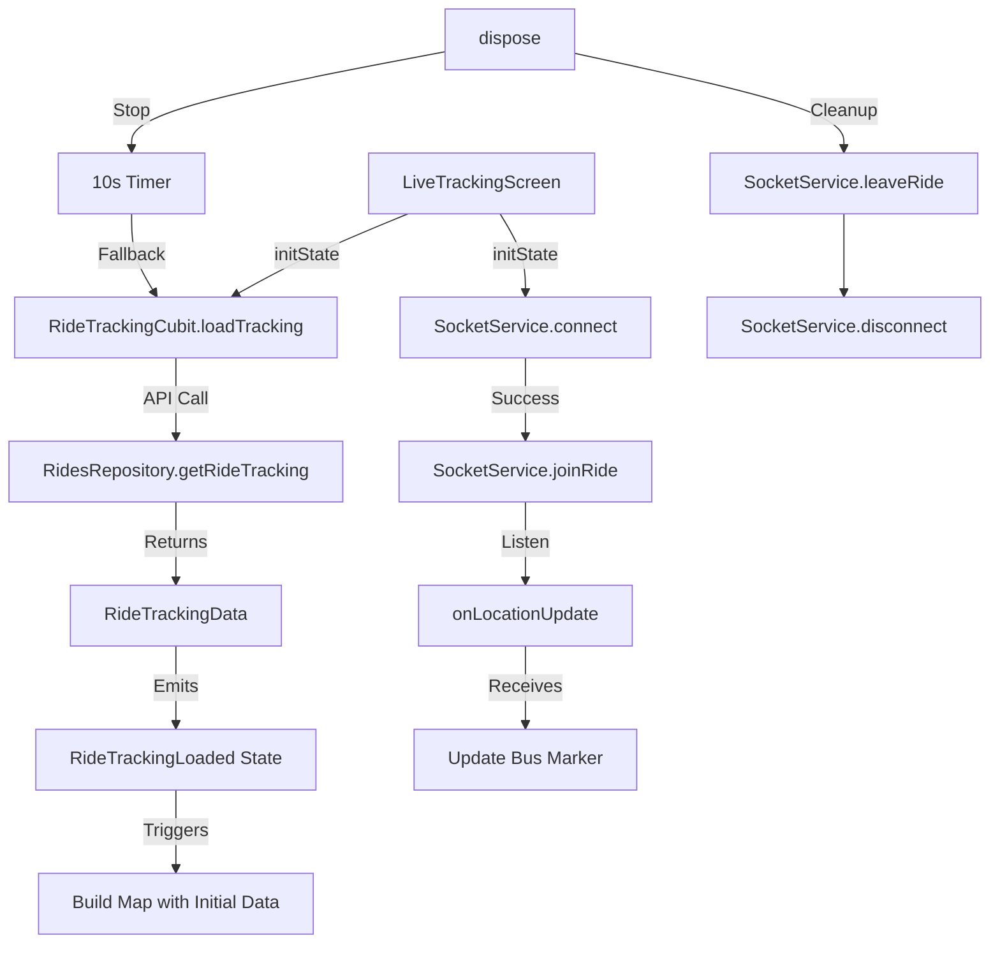

# Design Document: Parent Live Tracking

## Overview

The Parent Live Tracking feature provides a real-time map-based visualization of a child's bus location during active rides. This feature integrates seamlessly with the existing tracking infrastructure, reusing the RideTrackingCubit for data management and SocketService for real-time updates. The implementation follows Flutter best practices and maintains consistency with the existing codebase architecture.

### Key Design Decisions

1. **Reuse Existing Infrastructure**: Leverage RideTrackingCubit and SocketService rather than creating new state management
2. **Separate Screen**: Create LiveTrackingScreen as a distinct screen from the timeline-based RideTrackingScreen
3. **Hybrid Update Strategy**: Combine WebSocket real-time updates with polling fallback for resilience
4. **Google Maps Integration**: Use google_maps_flutter package for native map rendering
5. **Stateful Widget**: Use StatefulWidget to manage map controller and WebSocket lifecycle

## Architecture

### Component Hierarchy

```
LiveTrackingScreen (StatefulWidget)
├── BlocBuilder<RideTrackingCubit, RideTrackingState>
│   ├── Loading State → LoadingIndicator
│   ├── Error State → ErrorView with retry
│   └── Loaded State → MapView with RideInfoCard
│       ├── GoogleMap Widget
│       │   ├── Route Polyline
│       │   ├── Stop Markers (RouteStop)
│       │   ├── Child Pickup Marker (highlighted)
│       │   └── Bus Marker (real-time)
│       └── RideInfoCard (overlay)
│           ├── Ride Name
│           ├── Bus Info
│           ├── Driver Info
│           └── Status Badge
└── FloatingActionButtons
    ├── Recenter on Bus
    └── Fit All Markers
```

### Data Flow



### State Management

The feature uses the existing RideTrackingCubit for state management:

- **RideTrackingInitial**: Initial state before data load
- **RideTrackingLoading**: Loading tracking data from API
- **RideTrackingLoaded**: Contains RideTrackingData with all route and bus information
- **RideTrackingError**: Error state with message

Local state in LiveTrackingScreen manages:
- GoogleMapController for map operations
- Current bus location (updated via WebSocket)
- WebSocket connection status
- Map markers and polylines

## Components and Interfaces

### 1. LiveTrackingScreen

**Purpose**: Main screen widget that orchestrates map display and real-time updates

**Key Properties**:
```dart
class LiveTrackingScreen extends StatefulWidget {
  final String childId;
  final String rideId;
  
  const LiveTrackingScreen({
    required this.childId,
    required this.rideId,
  });
}
```

**State Variables**:
```dart
class _LiveTrackingScreenState extends State<LiveTrackingScreen> {
  GoogleMapController? _mapController;
  LatLng? _currentBusLocation;
  bool _isWebSocketConnected = false;
  final SocketService _socketService = SocketService();
  Set<Marker> _markers = {};
  Set<Polyline> _polylines = {};
}
```

**Lifecycle Methods**:
- `initState()`: Initialize cubit, connect WebSocket, start auto-refresh
- `dispose()`: Disconnect WebSocket, stop auto-refresh, dispose map controller
- `didChangeDependencies()`: Handle locale changes for RTL support

### 2. MapView Component

**Purpose**: Renders the Google Map with route, markers, and bus location

**Key Features**:
- Initial camera position centered on route
- Polyline connecting all route stops in order
- Markers for each stop with info windows
- Highlighted marker for child's pickup point
- Animated bus marker with custom icon

**Map Configuration**:
```dart
GoogleMap(
  initialCameraPosition: CameraPosition(
    target: _calculateRouteCenter(route.stops),
    zoom: 12.0,
  ),
  markers: _markers,
  polylines: _polylines,
  myLocationButtonEnabled: false,
  zoomControlsEnabled: false,
  mapToolbarEnabled: false,
  onMapCreated: _onMapCreated,
)
```

### 3. RideInfoCard Component

**Purpose**: Overlay card displaying ride details on the map

**Layout**:
```dart
Positioned(
  top: 16,
  left: 16,
  right: 16,
  child: Card(
    child: Padding(
      padding: EdgeInsets.all(16),
      child: Column(
        crossAxisAlignment: CrossAxisAlignment.start,
        children: [
          // Ride name with status badge
          // Bus number and plate
          // Driver name and phone
          // Connection status indicator
        ],
      ),
    ),
  ),
)
```

**RTL Support**: Uses Directionality widget to handle Arabic layout

### 4. Marker Management

**Marker Types**:

1. **Stop Markers**: Regular pickup points
   - Icon: Custom pin icon from assets
   - Color: Primary color
   - Info Window: Stop name and address

2. **Child Pickup Marker**: Highlighted pickup point
   - Icon: Custom highlighted pin icon
   - Color: Accent color
   - Info Window: "Your child's pickup point" + stop details

3. **Bus Marker**: Real-time bus location
   - Icon: Custom bus icon from assets
   - Rotation: Based on heading (if available)
   - Info Window: Bus number and current status

**Marker Creation**:
```dart
Marker _createStopMarker(RouteStop stop, bool isChildPickup) {
  return Marker(
    markerId: MarkerId(stop.id),
    position: LatLng(
      double.parse(stop.lat),
      double.parse(stop.lng),
    ),
    icon: isChildPickup 
      ? _childPickupIcon 
      : _stopIcon,
    infoWindow: InfoWindow(
      title: stop.name,
      snippet: stop.address,
    ),
  );
}
```

### 5. Route Polyline

**Purpose**: Visual representation of the bus route connecting all stops

**Implementation**:
```dart
Polyline _createRoutePolyline(List<RouteStop> stops) {
  // Sort stops by stopOrder
  final sortedStops = List<RouteStop>.from(stops)
    ..sort((a, b) => a.stopOrder.compareTo(b.stopOrder));
  
  return Polyline(
    polylineId: PolylineId('route'),
    points: sortedStops.map((stop) => LatLng(
      double.parse(stop.lat),
      double.parse(stop.lng),
    )).toList(),
    color: AppColors.primary,
    width: 4,
    patterns: [PatternItem.dash(20), PatternItem.gap(10)],
  );
}
```

### 6. WebSocket Integration

**Connection Lifecycle**:

```dart
void _initializeWebSocket() {
  final token = _getAuthToken(); // From auth service
  _socketService.connect(token);
  
  _socketService.joinRide(widget.rideId);
  
  _socketService.onLocationUpdate((data) {
    _handleLocationUpdate(data);
  });
}

void _handleLocationUpdate(dynamic data) {
  if (data is Map<String, dynamic>) {
    final lat = data['lat'] as double?;
    final lng = data['lng'] as double?;
    
    if (lat != null && lng != null) {
      setState(() {
        _currentBusLocation = LatLng(lat, lng);
        _updateBusMarker(_currentBusLocation!);
      });
    }
  }
}

void _cleanupWebSocket() {
  _socketService.leaveRide(widget.rideId);
  _socketService.dispose();
}
```

### 7. Camera Control

**Auto-fit on Load**:
```dart
void _fitMapToRoute(List<RouteStop> stops, LatLng? busLocation) {
  final bounds = _calculateBounds(stops, busLocation);
  _mapController?.animateCamera(
    CameraUpdate.newLatLngBounds(bounds, 50), // 50px padding
  );
}
```

**Recenter on Bus**:
```dart
void _recenterOnBus() {
  if (_currentBusLocation != null) {
    _mapController?.animateCamera(
      CameraUpdate.newLatLngZoom(_currentBusLocation!, 15),
    );
  }
}
```

## Data Models

All data models are reused from the existing `api_models.dart`:

### RideTrackingData
- `occurrence`: RideOccurrence (id, date, status, timestamps)
- `ride`: RideInfo (id, name, type)
- `bus`: TrackingBus (id, busNumber, plateNumber, currentLocation)
- `driver`: DriverInfo (id, name, phone, avatar)
- `route`: TrackingRoute (id, name, stops)
- `children`: List<TrackingChild>

### TrackingRoute
- `id`: String
- `name`: String
- `stops`: List<RouteStop>

### RouteStop
- `id`: String
- `name`: String
- `address`: String
- `lat`: String (coordinate)
- `lng`: String (coordinate)
- `stopOrder`: int (for sorting)

### TrackingBus
- `id`: String
- `busNumber`: String
- `plateNumber`: String
- `currentLocation`: dynamic (can be null or {lat, lng})

### TrackingChild
- `id`: String
- `status`: String
- `pickupTime`: String
- `child`: ChildInfo
- `pickupPoint`: PickupPoint

### LocationUpdate Event (WebSocket)
```dart
{
  "lat": double,
  "lng": double,
  "heading": double?, // Optional bearing
  "timestamp": String,
  "speed": double? // Optional speed in km/h
}
```


## Correctness Properties

A property is a characteristic or behavior that should hold true across all valid executions of a system—essentially, a formal statement about what the system should do. Properties serve as the bridge between human-readable specifications and machine-verifiable correctness guarantees.

### Property 1: Route polyline connects all stops in order

*For any* TrackingRoute with stops, the polyline points should match the stops sorted by stopOrder, connecting them consecutively.

**Validates: Requirements 1.2, 4.1, 4.2**

### Property 2: All route stops are displayed as markers

*For any* TrackingRoute, the number of stop markers created should equal the total number of stops in the route, regardless of whether children are assigned to them.

**Validates: Requirements 1.3, 4.6**

### Property 3: Child's pickup point is visually distinct

*For any* RideTrackingData with a child's pickup point, the marker for that specific stop should use a different icon or color than regular stop markers.

**Validates: Requirements 1.4, 4.5**

### Property 4: Bus marker displays at current location

*For any* TrackingBus with a non-null currentLocation, a bus marker should be created at those exact coordinates.

**Validates: Requirements 1.5**

### Property 5: Camera bounds include all route elements

*For any* route with stops and bus location, the calculated camera bounds should encompass all stop coordinates and the bus location.

**Validates: Requirements 1.6**

### Property 6: Tracking data extraction is complete

*For any* RideTrackingLoaded state, the system should successfully extract all required data: route stops from TrackingRoute, bus location from TrackingBus, and child's pickup point from TrackingChild.

**Validates: Requirements 2.2, 2.3, 2.4**

### Property 7: Error states display error UI

*For any* RideTrackingError state, the system should display an error message widget to the user.

**Validates: Requirements 2.5, 8.2**

### Property 8: Location updates modify bus marker position

*For any* valid locationUpdate event with lat/lng coordinates, the bus marker position should be updated to match those coordinates.

**Validates: Requirements 3.3**

### Property 9: Stop markers contain complete information

*For any* RouteStop marker, the info window should contain both the stop name and address.

**Validates: Requirements 4.4**

### Property 10: RideInfoCard displays all ride details

*For any* RideTrackingData, the RideInfoCard should display the ride name, bus number, plate number, driver name, and ride status.

**Validates: Requirements 5.2, 5.3, 5.4, 5.5**

### Property 11: Connection status reflects actual state

*For any* connection state (WebSocket connected or polling fallback), the UI should display the correct connection status indicator.

**Validates: Requirements 6.5**

### Property 12: Arabic locale applies RTL layout

*For any* UI component (RideInfoCard, marker info windows) when the app locale is Arabic, the text direction should be RTL and all text should use Arabic localization strings.

**Validates: Requirements 7.1, 7.2, 7.3**

### Property 13: Loading state displays loading indicator

*For any* RideTrackingLoading state, the system should display a loading indicator widget.

**Validates: Requirements 8.1**

### Property 14: Marker taps show info windows

*For any* stop marker, when tapped, the system should display the marker's info window with stop details.

**Validates: Requirements 9.3**

### Property 15: Location updates are throttled

*For any* sequence of rapid location updates, the system should limit bus marker updates to a maximum rate of one per second.

**Validates: Requirements 10.1**

### Property 16: Marker assets are cached

*For any* marker icon asset, the system should load it once and reuse the cached BitmapDescriptor for all markers of that type, rather than loading it repeatedly.

**Validates: Requirements 10.5**

## Error Handling

### WebSocket Connection Errors

**Scenario**: WebSocket fails to connect or disconnects unexpectedly

**Handling**:
1. Log error with details for debugging
2. Set `_isWebSocketConnected = false`
3. Continue using RideTrackingCubit's polling mechanism (10-second interval)
4. Display connection status indicator showing "Polling mode"
5. Attempt to reconnect on next screen resume

**Code**:
```dart
void _handleWebSocketError(dynamic error) {
  dev.log('WebSocket error: $error', name: 'LiveTrackingScreen');
  setState(() {
    _isWebSocketConnected = false;
  });
  // Polling continues via RideTrackingCubit
}
```

### Map Initialization Errors

**Scenario**: Google Maps fails to initialize (missing API key, network issues)

**Handling**:
1. Catch error in `onMapCreated` callback
2. Display error message with retry button
3. Log error details
4. Provide fallback to timeline view

**Code**:
```dart
void _onMapCreated(GoogleMapController controller) {
  try {
    _mapController = controller;
    _initializeMapData();
  } catch (e) {
    dev.log('Map initialization error: $e', name: 'LiveTrackingScreen');
    _showMapError();
  }
}
```

### Invalid Coordinate Data

**Scenario**: RouteStop or bus location has invalid lat/lng values

**Handling**:
1. Validate coordinates before parsing (check for empty strings, null)
2. Use try-catch around `double.parse()`
3. Skip invalid stops with warning log
4. Continue displaying valid stops

**Code**:
```dart
LatLng? _parseCoordinates(String lat, String lng) {
  try {
    if (lat.isEmpty || lng.isEmpty) return null;
    final latitude = double.parse(lat);
    final longitude = double.parse(lng);
    if (latitude < -90 || latitude > 90) return null;
    if (longitude < -180 || longitude > 180) return null;
    return LatLng(latitude, longitude);
  } catch (e) {
    dev.log('Invalid coordinates: lat=$lat, lng=$lng', name: 'LiveTrackingScreen');
    return null;
  }
}
```

### No Active Ride

**Scenario**: Child has no active ride to track

**Handling**:
1. RideTrackingCubit emits RideTrackingError with "No active ride found"
2. Display empty state with message
3. Provide button to return to rides list
4. Stop WebSocket connection attempts

### Missing Route Data

**Scenario**: RideTrackingData has empty stops list

**Handling**:
1. Display error message: "Route information unavailable"
2. Show only bus marker if bus location exists
3. Disable route polyline rendering
4. Log warning for debugging

## Testing Strategy

### Dual Testing Approach

This feature requires both unit tests and property-based tests for comprehensive coverage:

- **Unit tests**: Verify specific examples, edge cases, and integration points
- **Property tests**: Verify universal properties across all inputs

### Unit Testing Focus

Unit tests should cover:

1. **Lifecycle Integration**:
   - Screen mount triggers cubit.loadTracking() (Requirement 2.1)
   - Screen mount connects to WebSocket (Requirement 3.1)
   - WebSocket joins ride channel after connection (Requirement 3.2)
   - Screen dispose leaves ride channel (Requirement 3.5)
   - Screen dispose disconnects WebSocket (Requirement 3.6)
   - Screen dispose cleans up map resources (Requirement 10.4)

2. **Error Scenarios**:
   - WebSocket connection failure falls back to polling (Requirement 6.2, 8.3)
   - WebSocket disconnection preserves last bus location (Requirement 6.1)
   - WebSocket reconnection resumes real-time updates (Requirement 6.3)
   - Map initialization failure shows error (Requirement 8.4)
   - No tracking data shows empty state (Requirement 8.5)

3. **UI Presence**:
   - Map initialization sets appropriate zoom and center (Requirement 1.1)
   - RideInfoCard overlay is displayed (Requirement 5.1)
   - Route polyline uses distinct color (Requirement 4.3)
   - Bus marker tap shows bus information (Requirement 9.4)
   - Recenter button is present and functional (Requirement 9.5)
   - Fit all button is present and functional (Requirement 9.6)

4. **Lifecycle Behavior**:
   - Screen backgrounded pauses WebSocket (Requirement 10.2)
   - Screen foregrounded resumes WebSocket (Requirement 10.3)
   - Polling uses 10-second interval (Requirement 6.4)

### Property-Based Testing Focus

Property tests should verify universal behaviors across randomized inputs. Each property test should:
- Run minimum 100 iterations
- Use a property-based testing library (e.g., faker for Dart)
- Reference the design property in a comment tag

**Property Test Configuration**:
```dart
// Feature: parent-live-tracking, Property 1: Route polyline connects all stops in order
test('route polyline connects stops in order', () {
  for (int i = 0; i < 100; i++) {
    final route = generateRandomRoute(); // Random stops with random stopOrder
    final polyline = createRoutePolyline(route.stops);
    
    final sortedStops = route.stops.sorted((a, b) => a.stopOrder.compareTo(b.stopOrder));
    final expectedPoints = sortedStops.map((s) => LatLng(double.parse(s.lat), double.parse(s.lng)));
    
    expect(polyline.points, equals(expectedPoints));
  }
});
```

**Properties to Test**:

1. **Property 1**: Route polyline connects all stops in order
   - Generate random routes with varying stop counts and orders
   - Verify polyline points match sorted stops

2. **Property 2**: All route stops are displayed as markers
   - Generate random routes with varying stop counts
   - Verify marker count equals stop count

3. **Property 3**: Child's pickup point is visually distinct
   - Generate random tracking data with different pickup points
   - Verify child's pickup marker uses different icon

4. **Property 4**: Bus marker displays at current location
   - Generate random bus locations
   - Verify bus marker position matches location

5. **Property 5**: Camera bounds include all route elements
   - Generate random routes and bus locations
   - Verify calculated bounds encompass all coordinates

6. **Property 6**: Tracking data extraction is complete
   - Generate random RideTrackingData
   - Verify all data fields are extracted correctly

7. **Property 7**: Error states display error UI
   - Generate random error messages
   - Verify error widget is displayed

8. **Property 8**: Location updates modify bus marker position
   - Generate random location update events
   - Verify bus marker position updates

9. **Property 9**: Stop markers contain complete information
   - Generate random route stops
   - Verify info windows contain name and address

10. **Property 10**: RideInfoCard displays all ride details
    - Generate random tracking data
    - Verify all fields are displayed in card

11. **Property 11**: Connection status reflects actual state
    - Generate random connection states
    - Verify UI shows correct status

12. **Property 12**: Arabic locale applies RTL layout
    - Test with Arabic locale
    - Verify RTL layout and Arabic text

13. **Property 13**: Loading state displays loading indicator
    - Test with loading state
    - Verify loading widget is shown

14. **Property 14**: Marker taps show info windows
    - Generate random markers
    - Verify tap shows info window

15. **Property 15**: Location updates are throttled
    - Generate rapid location updates (>1 per second)
    - Verify updates are throttled to max 1/second

16. **Property 16**: Marker assets are cached
    - Create multiple markers of same type
    - Verify asset is loaded once and reused

### Test Data Generation

For property-based tests, create generators for:

```dart
// Generate random RouteStop
RouteStop generateRandomStop({int? order}) {
  return RouteStop(
    id: faker.guid.guid(),
    name: faker.address.streetName(),
    address: faker.address.streetAddress(),
    lat: faker.randomGenerator.decimal(min: -90, max: 90).toString(),
    lng: faker.randomGenerator.decimal(min: -180, max: 180).toString(),
    stopOrder: order ?? faker.randomGenerator.integer(100),
  );
}

// Generate random TrackingRoute
TrackingRoute generateRandomRoute({int? stopCount}) {
  final count = stopCount ?? faker.randomGenerator.integer(10, min: 2);
  final stops = List.generate(count, (i) => generateRandomStop(order: i));
  return TrackingRoute(
    id: faker.guid.guid(),
    name: faker.company.name(),
    stops: stops..shuffle(), // Shuffle to test sorting
  );
}

// Generate random RideTrackingData
RideTrackingData generateRandomTrackingData() {
  final route = generateRandomRoute();
  final childPickupStop = route.stops[faker.randomGenerator.integer(route.stops.length)];
  
  return RideTrackingData(
    occurrence: generateRandomOccurrence(),
    ride: generateRandomRideInfo(),
    bus: generateRandomBus(),
    driver: generateRandomDriver(),
    route: route,
    children: [generateRandomChild(pickupPoint: childPickupStop)],
  );
}
```

### Integration Testing

Integration tests should verify:
1. Complete flow from screen mount to map display
2. WebSocket connection and location update handling
3. Cubit state changes trigger correct UI updates
4. Navigation to/from live tracking screen

### Widget Testing

Widget tests should verify:
1. RideInfoCard renders correctly with all data
2. Loading state shows loading indicator
3. Error state shows error message with retry
4. Markers are created with correct properties
5. Polyline is created with correct styling

## Performance Considerations

### Location Update Throttling

Implement throttling to prevent excessive re-renders:

```dart
Timer? _locationUpdateThrottle;

void _handleLocationUpdate(dynamic data) {
  if (_locationUpdateThrottle?.isActive ?? false) return;
  
  _locationUpdateThrottle = Timer(Duration(seconds: 1), () {
    // Process location update
    _updateBusLocation(data);
  });
}
```

### Marker Asset Caching

Load marker icons once during initialization:

```dart
BitmapDescriptor? _stopIcon;
BitmapDescriptor? _childPickupIcon;
BitmapDescriptor? _busIcon;

Future<void> _loadMarkerIcons() async {
  _stopIcon = await BitmapDescriptor.fromAssetImage(
    ImageConfiguration(size: Size(48, 48)),
    'assets/icons/stop_marker.png',
  );
  _childPickupIcon = await BitmapDescriptor.fromAssetImage(
    ImageConfiguration(size: Size(48, 48)),
    'assets/icons/child_pickup_marker.png',
  );
  _busIcon = await BitmapDescriptor.fromAssetImage(
    ImageConfiguration(size: Size(48, 48)),
    'assets/icons/bus_marker.png',
  );
}
```

### Lifecycle Management

Pause updates when screen is not visible:

```dart
@override
void didChangeAppLifecycleState(AppLifecycleState state) {
  if (state == AppLifecycleState.paused) {
    _socketService.leaveRide(widget.rideId);
    context.read<RideTrackingCubit>().stopAutoRefresh();
  } else if (state == AppLifecycleState.resumed) {
    _socketService.joinRide(widget.rideId);
    context.read<RideTrackingCubit>().startAutoRefresh();
  }
}
```

### Memory Management

Dispose resources properly:

```dart
@override
void dispose() {
  _mapController?.dispose();
  _locationUpdateThrottle?.cancel();
  _socketService.leaveRide(widget.rideId);
  _socketService.dispose();
  super.dispose();
}
```

## Localization

### Localization Keys

Required localization keys (add to existing localization files):

```dart
// English (en.json)
{
  "live_tracking_title": "Live Tracking",
  "ride_status_scheduled": "Scheduled",
  "ride_status_in_progress": "In Progress",
  "ride_status_completed": "Completed",
  "connection_status_realtime": "Real-time updates",
  "connection_status_polling": "Polling mode",
  "child_pickup_point": "Your child's pickup point",
  "bus_location": "Bus Location",
  "recenter_map": "Recenter",
  "fit_all": "Fit All",
  "no_active_ride": "No active ride found",
  "map_error": "Unable to load map",
  "retry": "Retry",
  "loading_tracking": "Loading tracking data..."
}

// Arabic (ar.json)
{
  "live_tracking_title": "التتبع المباشر",
  "ride_status_scheduled": "مجدول",
  "ride_status_in_progress": "قيد التنفيذ",
  "ride_status_completed": "مكتمل",
  "connection_status_realtime": "تحديثات فورية",
  "connection_status_polling": "وضع الاستقصاء",
  "child_pickup_point": "نقطة استلام طفلك",
  "bus_location": "موقع الحافلة",
  "recenter_map": "إعادة التوسيط",
  "fit_all": "عرض الكل",
  "no_active_ride": "لا توجد رحلة نشطة",
  "map_error": "تعذر تحميل الخريطة",
  "retry": "إعادة المحاولة",
  "loading_tracking": "جاري تحميل بيانات التتبع..."
}
```

### RTL Support

Use `Directionality` widget for RTL layout:

```dart
Widget build(BuildContext context) {
  final isRTL = Localizations.localeOf(context).languageCode == 'ar';
  
  return Directionality(
    textDirection: isRTL ? TextDirection.rtl : TextDirection.ltr,
    child: Scaffold(
      // ... content
    ),
  );
}
```

## Dependencies

### Required Packages

Add to `pubspec.yaml`:

```yaml
dependencies:
  google_maps_flutter: ^2.5.0
  socket_io_client: ^2.0.3+1  # Already exists
  flutter_bloc: ^8.1.3  # Already exists
  equatable: ^2.0.5  # Already exists
```

### Platform Configuration

**Android** (`android/app/src/main/AndroidManifest.xml`):
```xml
<manifest>
  <application>
    <meta-data
      android:name="com.google.android.geo.API_KEY"
      android:value="YOUR_GOOGLE_MAPS_API_KEY"/>
  </application>
</manifest>
```

**iOS** (`ios/Runner/AppDelegate.swift`):
```swift
import GoogleMaps

@UIApplicationMain
@objc class AppDelegate: FlutterAppDelegate {
  override func application(
    _ application: UIApplication,
    didFinishLaunchingWithOptions launchOptions: [UIApplication.LaunchOptionsKey: Any]?
  ) -> Bool {
    GMSServices.provideAPIKey("YOUR_GOOGLE_MAPS_API_KEY")
    GeneratedPluginRegistrant.register(with: self)
    return super.application(application, didFinishLaunchingWithOptions: launchOptions)
  }
}
```

## Security Considerations

1. **API Key Protection**: Store Google Maps API key securely, restrict by platform
2. **WebSocket Authentication**: Token passed in connection headers
3. **Data Validation**: Validate all coordinate data before parsing
4. **Error Information**: Don't expose sensitive error details to users

## Future Enhancements

1. **ETA Calculation**: Show estimated time to child's pickup point
2. **Notifications**: Push notification when bus is approaching
3. **Historical Route**: Show previously traveled path
4. **Traffic Layer**: Display traffic conditions on route
5. **Multiple Children**: Support tracking multiple children simultaneously
6. **Offline Mode**: Cache last known location for offline viewing
